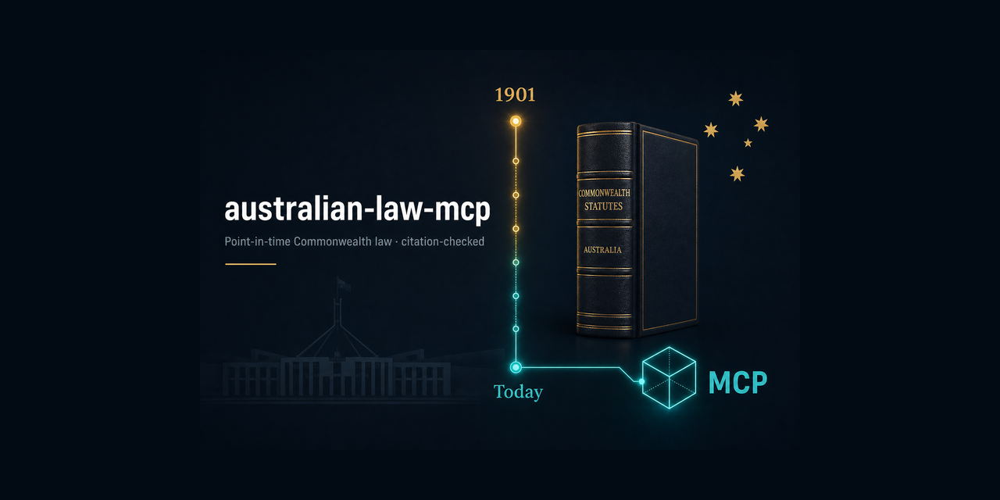

# Australian Law MCP

**Australian legal research inside your AI app — with browser research through Aside.**

Retrieve Commonwealth legislation as it stood on a chosen date, search supported
legal sources, and check citations while preparing advice or reviewing a draft.
Australian Law MCP connects your AI to public legislation registers, judgments,
tribunal decisions, ATO rulings, treaties and explanatory material.

**With Aside, your AI can continue the investigation in the browser.** It can
follow missing source links, read accessible judgments and PDFs, collect relevant
passages with paragraph or page references, and investigate later citing
decisions. Your AI can then prepare a research note for review, keeping source
evidence separate from its interpretation and recording what still needs checking.
Evidence and progress are saved for the matter so you can resume the work later.

The Aside workflow is an **optional preview in this repository**, available after
project setup in local Codex or Claude Code sessions on **macOS 15 or later**.
Windows supports the core law tools; Aside browser follow-up is not available
there yet.

> **Download the extension, or build it here.** The desktop installer is
> attached to the
> [latest release](https://github.com/chldbwnstm/australian-law-mcp/releases/latest)
> — `au-law-mcp-1.0.2.mcpb` (~4 MB), which the Claude desktop app installs by
> double-click. There is still no npm package (`npx -y au-law-mcp` answers
> **404**), so a CLI, IDE or Codex client is registered from a checkout:
> `npm ci --ignore-scripts && npm run build` gives it something to register, by
> `claude mcp add` or by `node build/index.js setup`, which writes a launch
> command it has checked on disk. `npm run build:mcpb` rebuilds the same bundle
> if you would rather not download it. Pick **one per host** — full route in
> [INSTALL.md](INSTALL.md).


> **No legal-data API key is needed for the core law tools.** They use public
> sources and work with Codex, Claude Desktop, Claude Code, Cursor, Windsurf,
> VS Code, Zed, Gemini CLI, and other MCP clients. Aside browser research uses
> the separate macOS setup below.

## Install

**Install once per host, not once per tab.** The Claude desktop app and the
`claude` command line read different configuration, so the choice that matters is
*where you are running Claude* — not whether you are in Chat or in Code.

### 1. Find your host

| Host | What to install | Covers |
|---|---|---|
| **Claude desktop app** | The `.mcpb` extension, installed by double-click | Chat **and** the app's local Code sessions — one install, both tabs |
| **`claude` in a terminal or an IDE, on a machine with no desktop app** | One `~/.claude.json` entry, from a source checkout | Terminal and IDE sessions |
| **Codex desktop, Cursor, Windsurf, VS Code, Zed, other MCP clients** | That client's own MCP config, from a source checkout | That client |

> **One host, one route.** On a machine with the desktop app, installing the
> extension *and* also running `claude mcp add` registers the same server twice:
> it turns up as both `Australian Law` (the extension) and `australian-law` (the
> CLI entry). That is the duplicate an outside tester hit. The two are not even
> the same program — the extension runs the build packed inside the bundle on the
> app's own Node, the CLI entry runs `build/index.js` in your checkout on yours —
> so they drift apart the moment one is rebuilt. If you use both the app and the
> terminal CLI, [INSTALL.md](INSTALL.md) keeps the extension and skips
> `claude mcp add` — the tools then live in the app, not in your terminal. It also
> has the removal step if you already have both.
>
> The same goes for the setup wizard: `node build/index.js setup` lists **Claude
> Desktop** among the clients it can write to, and picking that number puts a
> second definition of this server into `claude_desktop_config.json`, beside the
> extension you already installed. If you have the extension, do not pick it.

### 2a. Claude desktop app — install the extension

Download `au-law-mcp-1.0.2.mcpb` (~4 MB) from the
[latest release](https://github.com/chldbwnstm/australian-law-mcp/releases/latest),
or open the copy someone sent you — it is the same file. No clone, no terminal,
no Node.js.

Open it, choose **Install**, and restart the app. Nothing further is needed for
Code: the app supplies installed extensions to its own local Code sessions.

To rebuild it from source instead:

```bash
git clone https://github.com/chldbwnstm/australian-law-mcp
cd australian-law-mcp
npm ci --ignore-scripts
npm run build:mcpb          # → release/au-law-mcp-1.0.2.mcpb
```

That build unpacks the bundle, starts the server inside it and checks its tool
list before it finishes, so a file that appears has already been proved to run.
The released file is built the same way.
Step-by-step version for a non-technical tester: [docs/TRY-IT.md](docs/TRY-IT.md).

### 2b. Codex, or a machine with no desktop app — let the agent register it

Start a session that runs on your own computer — in Codex, a new task with
**Local** selected if it asks where to run. Then send:

```text
Install https://github.com/chldbwnstm/australian-law-mcp as a local MCP server
for the app I am using right now. Follow INSTALL.md in that repository and do
the setup for me. Register it once for this host only: if Australian Law is
already available here, or already installed as a Claude desktop extension,
tell me instead of adding a second entry under another name. Preserve my
existing settings, tell me if I need to restart, and verify the law tools.
```

If asked to select a folder, create or choose one called **Australian Law** and
keep using it for your trial. Follow the app's prompts to allow the installation;
if it asks you to restart, close and reopen the app and start a new session.

### 3. Try this question

```text
Use the connected Australian Law tools to retrieve ACL s 18.
Show me the provision and its official source link.
```

The answer should identify **schedule 2, section 18 of the Competition and
Consumer Act 2010**. Open the source link to see the original provision.
If the app says the tools are unavailable, send: **“Please check and fix my
Australian Law connection, then try again.”**

### Optional: let the extension finish blocked sources (Mac, off by default)

Some publishers refuse this server outright, so questions about Federal Court
judgments or anything AustLII-hosted come back as a blocked source and a link.
On a Mac with [Aside](https://docs.aside.com/help/get-started) installed, you
can let the server finish those lookups in your own browser instead. In the
Claude desktop app it is a switch on the extension itself —
**Settings → Extensions → Australian Law → “Finish blocked legal sources using
the Aside browser”** — so there is no file to edit and nothing to install into
a project. Read
[what that switch does and does not do](#optional-finishing-a-blocked-source-in-your-own-browser)
before turning it on; with Aside absent it does nothing at all.

### Optional: add Aside browser research (macOS only)

**On macOS 15 or later, your AI can also use Aside to follow up source links,
read accessible judgments and PDFs, and save its research progress.** This is a
preview in the current source version. Windows users can use the standard law
tools; Aside follow-up is not available on Windows yet.

This is the other half of the same gap, not a duplicate of the switch above.
The switch lets the *server* finish one blocked lookup inside a single answer,
in any host including desktop Chat. The `au-law-followup` skill below is a
*research session* — per-matter budgets, saved evidence, checkpoints you can
stop and resume — and it runs only in a local Codex or Claude Code session
opened on a checkout, because Chat loads extensions and never loads a project
skill.

1. [Install Aside](https://docs.aside.com/help/get-started) and open it.
2. Open your project folder in a local Codex or Claude Code session, then send:

   ```text
   Add the Aside browser research preview to this project. Follow INSTALL.md
   in the Australian Law repository, using its current source version.
   Check that my Mac is supported, find Aside, and handle the setup for me.
   Add only the Aside entry and the project skill; leave my existing Australian
   Law registration exactly as it is. Tell me if I need to restart the app, and
   verify both the law tools and Aside connection before saying it is ready.
   ```

3. Follow any restart instructions, then try a [browser research example below](#example-1-finish-missing-reasons-and-pdfs).

This adds a project-local `aside` server and the `au-law-followup` skill to that
folder. It does not touch how the law server itself is registered, so it is safe
alongside the desktop extension; it does need the source checkout, because the
skill ships in it.

For other apps, manual setup, removing a duplicate registration, or
troubleshooting, see [INSTALL.md](INSTALL.md).

---

**Best used in day-to-day law firm work:**

Copy a question into your AI app and ask it to use Australian Law. Replace the dates
and provisions with those relevant to your matter; ask for source links and any
limits on what was checked. The Aside examples require the optional Mac setup
above and enable additional research for the selected matter.

| Work on your desk | Example question |
|---|---|
| **Research — collect missing originals with Aside** | “Enable missing_sources mode for a new matter at ./matters/source-check. Use Aside to follow up the missing originals from our law-tool results. Keep within 10 pages, 3 documents and 5 active minutes. Save relevant passages with source links and paragraph or page references, then prepare a research note showing what was read and what remains unresolved.” |
| **Litigation — investigate later citing decisions with Aside** | “Enable extended mode for a new matter at ./matters/citation-review. Start with [2020] HCA 41 and use Aside to investigate later citing decisions. Keep within 30 pages, 10 documents and 15 active minutes. Save the passages discussing it, explain the apparent treatment, and state the searches and sources actually covered.” |
| **Family law — reviewing an older advice template** | “Retrieve Family Law Act 1975 (Cth) s 60CC as at 5 May 2024 and 6 May 2024. Compare the wording and suggest which statements in this fictional parenting advice template need review, with source links. Flag application or transitional questions separately.” |
| **Commercial disputes — preparing a letter of demand** | “I'm preparing a letter of demand about misleading representations. Retrieve ACL s 18 and identify its Act and schedule so I can cite it accurately.” |
| **Litigation — checking a draft before partner review** | “Check the statutory citations in this draft submission. For each one, show the provision and flag incorrect pinpoints, wording that does not support the claim, and anything you could not verify.” |
| **Employment — researching a redundancy dispute** | “Find Fair Work Commission decisions about genuine redundancy and consultation obligations. Give me decision dates, identifiers and links to the reasons, and say where full reasons are unavailable.” |
| **Disputes — researching the law at the time of the conduct** | “The representations were made on 30 June 2010. Retrieve s 52 of the Trade Practices Act as in force that day, identify the compilation, and find relevant transitional provisions for me to review.” |
| **Employment advisory — preparing a client update** | “Check whether Fair Work Act s 340 has changed since 1 January 2022. Identify any amending Acts and compare the provision then and now, with sources for my client update.” |

---

## Optional browser follow-up with Aside — source preview, macOS only

**Available in this source tree on local macOS 15.0+ after project setup.**
In Codex desktop or Claude Code desktop, your AI can use **Aside MCP** to retrieve
missing originals, read judgment PDFs, investigate later citing decisions, and
save evidence and progress for the matter. The AI starts with Australian Law MCP
and continues through Aside when further source checks are needed.

This is an **unreleased preview** that exists only in this source tree. The
`.mcpb` bundle does not carry it — `npm run build:mcpb` packs `build/` and its
runtime dependencies, not the `companion/` skill — so installing the desktop
extension alone does not enable it. It needs a checkout and a local Codex or
Claude Code session.

| Feature | macOS | Windows |
|---|---|---|
| Existing Australian Law MCP tools | Supported | Supported |
| Optional browser follow-up through Aside MCP | Preview in this source tree for local macOS 15.0+ with Aside installed and connected | Unavailable; deferred until Aside supports Windows and this integration is validated there |

Windows users can continue using the existing law tools and open remaining source
links themselves. The companion also requires local execution: WSL, Linux, remote
sessions and older macOS versions are unsupported. Windows browser follow-up will
remain unavailable until Aside supports Windows and this integration is validated
there; no alternative browser or remote-Mac workaround is included.

### Enable Aside once for your project

Follow the [simple Aside setup above](#optional-add-aside-browser-research-macos-only).
Use the same project folder after setup so the AI can find its research skill
and saved progress. Detailed commands and connection checks are in
[INSTALL.md](INSTALL.md#optional-aside-follow-up-preview).

### Choose how much additional research to do

| Mode | What the AI does | Initial allowance for a new matter |
|---|---|---|
| Standard / `off` | Uses the law tools and reports missing sources for you to follow up | No Aside work |
| Complete missing sources / `missing_sources` | Uses Aside to collect missing originals, passages and PDF reasons | 10 browser pages, 3 documents, 5 active minutes |
| Extended research / `extended` | Also investigates later citing decisions and wider source gaps, then drafts an interpretation supported by the collected evidence | 30 browser pages, 10 documents, 15 active minutes |

Opt-in and usage are saved per matter. Changing modes or restarting a session
does not reset accumulated usage or automatically increase an existing matter's
limits. When an allowance is reached, the AI saves what it found and reports the
remaining gaps.

### Example 1: finish missing reasons and PDFs

After setup, paste this fictional exercise into the same project's local session.
It needs no client document:

```text
Use Australian Law MCP and the au-law-followup skill for a fictional redundancy
research exercise. Create a new matter folder at ./matters/redundancy-demo and
enable missing_sources mode for this matter.

Retrieve Fair Work Act 2009 (Cth) s 389 and identify the compilation date.
Search Fair Work Commission decisions about genuine redundancy and consultation,
then select up to three relevant decisions. If the law tools return only metadata
or a PDF link, use Aside to retrieve and inspect the original reasons where access
permits. Stay within 10 browser pages, 3 documents and 5 active minutes.

Save the evidence and checkpoint in the matter folder. Return a table containing
the citation, date, source URL, whether the original reasons were actually read,
and a relevant passage with its paragraph or page reference. List every source
you could not access and every question that remains unresolved.
```

The result should distinguish **originals read**, **metadata only**, and
**unresolved checks**. A PDF link by itself does not mean its contents were read.
Evidence, usage and checkpoints are kept under the matter's `.au-law-followup/`
directory, with AI interpretations recorded separately from source evidence.

For a shorter request after an initial law-tool search:

```text
Use the au-law-followup skill and Aside to retrieve missing originals for this
matter. Create ./matters/source-check-demo in missing_sources mode.
Limit the research to 10 browser pages, 3 documents and 5 active minutes.
Save source links, paragraph or page references, and relevant quotations.
Report any material you could not verify and the questions still unresolved.
```

### Example 2: investigate later citing decisions

```text
Use Australian Law MCP and au-law-followup in a new extended research matter at
./matters/citation-demo. Start with [2020] HCA 41 and confirm its case identity.
Use Aside to investigate later citing judgments from accessible official sources
through today. State the jurisdictions, date range and searches actually covered.
Use no more than 30 browser pages, 10 documents and 15 active minutes.

For each judgment inspected, keep its own citation and source URL, quote the
passage discussing the original case, and explain the apparent treatment.
Save source evidence separately from your interpretation. Report uninspected
results and restricted sources; do not present this as a complete citator check.
```

### Check progress, stop or resume

Keep the same project and matter folder when continuing, including after an app
restart. Replace the path below with the matter you started:

| Action | Copy into the AI chat |
|---|---|
| Check progress | “Show the saved progress for `./matters/redundancy-demo`: sources read, unresolved tasks and remaining allowance.” |
| Stop | “Stop research for `./matters/redundancy-demo` now and save a checkpoint, including any running Aside session.” |
| Resume | “Resume `./matters/redundancy-demo` from its saved checkpoint. Clear the user stop, recheck local eligibility and inspect the existing Aside session before continuing. Keep the remaining allowance.” |
| Turn off follow-up | “Set follow-up to off for `./matters/redundancy-demo` and continue with the ordinary law tools.” |

Stopping prevents new work from being scheduled. An Aside agent already running
may continue; the AI must report an unconfirmed completion and preserve its
session for rechecking. Login, MFA, CAPTCHA or access decisions may still need
your input. Retrieving a document does not certify its authenticity or legal
effect.

The macOS lawyer pilot and broader source/reconnection checks remain outstanding,
and some legacy source tools do not yet emit structured follow-up gaps. See the
[validation record and remaining limits](docs/AI-NATIVE-FOLLOWUP-VALIDATION.md),
[installation instructions](INSTALL.md#optional-aside-follow-up-preview), and
[integration design](docs/AI-NATIVE-FOLLOWUP.md).

---

## Try a first task

### First task in Codex: check a draft before partner review

1. Start a new local chat after installation. You can try this fictional draft
   straight away; no document upload is needed.
2. Copy and send:

   ```text
   Use the Australian Law MCP tools to check this draft paragraph before I send
   it to the supervising partner:

   "Under the Competition and Consumer Act 2010 (Cth) s 18, misleading conduct
   is prohibited; see also Privacy Act 1988 (Cth) s 999."

   Check each statutory citation against the official text. Give me a short
   table: citation in the draft, what the source says, proposed correction,
   and official source link. Mark anything you cannot verify as unverified.
   Then suggest a corrected paragraph using only provisions you verified.
   ```

3. Review the table and open the source links. This example should flag the
   distinction between the Act's own s 18 and **schedule 2, s 18 (the ACL)**,
   and the nonexistent Privacy Act s 999. Review the proposed wording before
   using it in a draft.

For your next check, replace the fictional paragraph with the relevant excerpt
from your draft, using material your firm permits in the AI app.

### First task in Claude: prepare a redundancy research note

1. Start a new session after installation — an ordinary chat or a local Code
   session, whichever you use. Use the fictional brief below; no client file is
   needed.
2. Copy and send:

   ```text
   Use the Australian Law MCP tools to prepare a short research note for an
   employment partner. This is a fictional research exercise: an employer has
   abolished a role, and the employee disputes whether consultation occurred.

   Retrieve Fair Work Act 2009 (Cth) s 389 and identify the compilation date.
   Search Fair Work Commission decisions on genuine redundancy and consultation.
   Select up to three relevant decisions from the results you can verify.

   For each decision, give its name, citation, date, official source link, and
   why it may help our research. Include a paragraph reference where the reasons
   are available. If you only receive metadata, say that the reasons were not
   reviewed. Finish with questions we need to investigate about consultation.
   Show the note in this chat, with any search or source-access limitations.
   ```

3. Open the legislation and decision links, check the cited passages, and use the
   questions to plan further research. If full reasons were unavailable, read
   them at the linked source before relying on a decision's reasoning.

You can then ask: “Turn the verified material into a one-page internal research
note, keeping the source links and unresolved questions.”

---

## When a practitioner reaches for it

Use it to assemble the law and source material behind advice, check draft
citations, and prepare research notes for review. The core tools handle structured
lookups; the optional Aside workflow lets your AI continue into accessible source
pages and documents, retaining the evidence and progress for the matter.

The core-tool workflows below were exercised in the
[verification run](docs/VERIFICATION.md). The browser workflow has a separate
[preview validation record](docs/AI-NATIVE-FOLLOWUP-VALIDATION.md); its searches
cover the sources actually examined and do not constitute a complete citator check.

| You are… | You ask | What comes back | Behind it |
|---|---|---|---|
| **Checking a draft** advice, letter or submission before it leaves your desk — especially one an AI helped write | "Check every citation in this" | Each statutory pinpoint resolved against the Register's actual text and marked `✓`, `✗` or `⚠` with the reason. A section that exists but does not say what the draft claims is an `✗`, not a tick. A fabricated citation in a filed document is a professional problem, not a typo. | `legal_analysis` · `verify_citations` |
| **Advising on conduct** that happened on a particular date | "What did s 52 say on 30 June 2010, and under which title?" | The compilation in force that day, the provision as it then stood, a diff against today, the rename-or-repeal history, and the transitional provisions of the amending Acts. | `legal_analysis` · `applicable_law` |
| **Reading a provision**, a schedule or a fee table in the middle of something else | "What does ACL s 18 say" · "Which schedule carries the penalty table" | The provision from the authorised compilation, with its position in the Act. `ACL s 18` is fetched as `sch 2 s 18`, and the note says the body of the Act has its own s 18 and that it is a different provision. | `get_law_text`, `get_schedules` |
| **Telling a client what changed** | "How has FW Act s 340 changed since 2022, and by which Acts" | The amendment history of that provision read from the compilation's own endnotes, with each amending Act and its register id. | `legal_research` · `amendment_track` |
| **Reviewing delegated legislation** for compliance or in-house work | "Has the enabling Act moved since this instrument was last compiled?" | The enabling provisions, the Act's intervening amendments with register ids, and a flag that is a prompt to review — **not** a finding that the instrument is invalid. | `instrument_radar` |
| **Looking for a tribunal or regulator decision** that lives on a site you rarely visit | "Unfair dismissal decisions on serious misconduct" · "The ATO's decision impact statement on that case" | One search across the Fair Work Commission, the ATO Legal Database, the OAIC, the NACC, the Merit Protection Commissioner and thirteen other domains, each answer labelled with its source and with what the source did not hand over. | `search_decisions`, `get_decision_text` |
| **Building an interpretation argument** | "The explanatory memorandum for the 2010 consumer-law amendments" | The explanatory memorandum or explanatory statement — extrinsic material a court may use under s 15AB of the *Acts Interpretation Act 1901*. Evidence, not commentary. | `search_decisions` · `explanatory` |
| **Orienting across jurisdictions** | "Which State Acts correspond to this Commonwealth one?" | The State and Territory counterparts wherever a register can be queried, and a deep link with an explicit "not queried" label where it cannot (NSW, SA). | `legal_research` · `state_law_compare` |

### What that looks like

**The draft check.** An LLM writes a paragraph of advice:

> Under the Competition and Consumer Act 2010 (Cth) s 18, misleading conduct is prohibited; see also Privacy Act 1988 (Cth) s 999.

`legal_analysis({mode:"verify_citations", text: "…"})`:

```
[CITATION_ERRORS_FOUND] Citation check
Statute citations: 2 | ✓ 0 verified | ✗ 2 cannot be right | ⚠ 0 not checked here

✗ CONTENT_MISMATCH: Competition and Consumer Act 2010 (Cth) s 18 is 'Meetings of
  Commission'; misleading conduct is sch 2 s 18 (Australian Consumer Law)
✗ NOT_FOUND: Privacy Act 1988 (Cth) s 999 — Privacy Act 1988 [C2004A03712] has no
  s 999 in its current compilation. the body of the Act runs from s 1 to s 100 in
  this compilation (313 numbered entries). Nearest entries: 100 Regulations |
  99A Conduct of directors, employees and agents | 98A Treatment of partnerships

⚠️ 2 citation(s) cannot be right as written … Do NOT answer "verified".
```

Both citations are of real Acts. One section exists but says something else; the other does not exist. An existence-only checker catches the second and ticks the first.

**The date question.** `legal_analysis({mode:"applicable_law", lawName:"Trade Practices Act", date:"2010-06-30", provision:"s 52"})`:

```
▶ In force on that date
  Trade Practices Act 1974 — compilation window 2010-04-15 → 2010-07-01, registerId C2010C00331
  ⚠️ On that date this law was titled "Trade Practices Act 1974". It is now
     "Competition and Consumer Act 2010" — the SAME Act, renamed, NOT repealed
     and replaced. Cite it as "Trade Practices Act 1974" for conduct on 2010-06-30.

▶ s 52 as at 2010-06-30
52 Misleading or deceptive conduct
    (1) A corporation shall not, in trade or commerce, engage in conduct that is
        misleading or deceptive or is likely to mislead or deceive.

▶ Compared with today: CHANGED — 14 line(s) added, 4 removed.
- 52 Misleading or deceptive conduct
+ 52 Guarantee as to undisturbed possession

▶ Application / saving / transitional provisions in the 1 most recent amending Act(s)
  Trade Practices Amendment (Australian Consumer Law) Act (No. 2) 2010 [C2010A00103]
    • Schedule 2—Application of the Australian Consumer Law
    • Schedule 7—Transitional matters
```

Today's s 52 is a different provision. Answering from the current text would have been confidently wrong.

**The schedule trap, from the CLI.**

```bash
$ australian-law "what does s 18 of the ACL say"
  [routing] get_law_text — statute name + provision reference → get_law_text
  also: ACL is schedule 2 of Competition and Consumer Act 2010, so the reference
  was read as "sch 2 s 18". The body of the Act has its own section of that
  number, and it is a different provision.

Provision: sch 2 s 18 — 18 Misleading or deceptive conduct
In: Volume 4 › Schedule 2—The Australian Consumer Law › Chapter 2—General
    protections › Part 2-1—Misleading or deceptive conduct
18 Misleading or deceptive conduct
    (1) A person must not, in trade or commerce, engage in conduct that is
        misleading or deceptive or is likely to mislead or deceive.
```

### The calls behind the prompts

```
User: "what does s 18 of the ACL say"
→ get_schedules(registerId="C2004A00109") → get_law_text(registerId="C2004A00109", provision="sch 2 s 18")

User: "was misleading conduct illegal in 2010 and under which Act"
→ legal_analysis(mode="applicable_law", lawName="Trade Practices Act", date="2010-06-30", provision="s 52")

User: "find unfair dismissal decisions about serious misconduct"
→ search_decisions(domain="workplace", query="serious misconduct") → get_decision_text(domain="workplace", id="…")

User: "what tools do you have for point-in-time law"
→ discover_tools(intent="point in time law") → execute_tool(tool_name="get_provision_history", params={…})
```

---

## When not to reach for it

The limits are stated up front because a tool that is silent about them produces the confident wrong answer it was built to prevent. The full list is under [Honest limitations](#honest-limitations).

- **Case-law research proper.** AustLII, LawCite and the Federal Court refuse automated clients; reported series (CLR, FCR, NSWLR) cannot be verified; only NSW, the High Court and Queensland judgments are searched. Use Westlaw, Lexis, JADE or AustLII directly. This server gives you the deep link and says, in words, that it did not look.
- **"Is this case still good law?"** `cite_check` scans what it can reach and scopes its verdict to that. It is a mention search, not editorial treatment, and it never presents a partial scan as a clean bill of health. A practitioner uses a citator with treatment flags for this:

  ```
  ▶ Verdict: cited — later judgments mention this case and no contrary appellate
    language was found in what was scanned

  ▶ Later cases mentioning [2020] HCA 41 (13 found)
    NSW Caselaw: 1 mention(s)
    Queensland Judgments: 0 mention(s)
    High Court of Australia: 12 mention(s) (source reports 74)
  ```

- **NSW and SA statute text.** Both registers discourage automated access, so this server refuses to request them and hands back a link:

  ```
  [UPSTREAM_BLOCKED] nswLegislation is not fetched by this server (no public query
  surface and the register discourages automated access). This is a refusal to
  request, not an observation about the record — nothing here says the material is
  absent.
  Suggestions:
    1. ⚠️ Do not report this as 'no such case/legislation'. The source was never
       queried, so this response carries no evidence either way.
    2. Open directly: https://legislation.nsw.gov.au
  ```

- **Advice.** This software retrieves and formats public legal material. Reading the authorised text and forming a view is still the practitioner's work, and nothing here substitutes for it.

---

## Why wrong answers happen in Australian law

Australian law is split three ways and the split is where wrong answers come from.

- **Commonwealth vs State.** Most law that touches a person directly — tenancy, crime, land, licensing, traffic — is State law. A confident answer sourced only from the Federal Register is usually the wrong answer to the question that was asked.
- **Act vs schedule.** The Australian Consumer Law is not an Act. It is **schedule 2 of the *Competition and Consumer Act 2010***, so "ACL s 18" must be fetched as `sch 2 s 18`. The Act's own body has an s 18 too, and it is *"Meetings of Commission"*. A model that cites "CCA s 18" for misleading and deceptive conduct has cited a real section for a proposition it does not contain, and an existence-only citation checker signs that off with a tick.
- **Renamed vs repealed.** The *Trade Practices Act 1974* and the *Competition and Consumer Act 2010* are the **same Act**, same register id `C2004A00109`. Treating the rename as a repeal loses forty years of authority.

The other half of the problem is access. Several of the sources a researcher would reach for first — AustLII, LawCite, the Federal Court, the NSW and SA registers — refuse automated clients. **This server never answers a refusal with an absence.** A blocked source is reported as `[UPSTREAM_BLOCKED]` with a deep link, and the response says in terms that it carries no evidence either way.

---

## The 10 advertised tools

`ListTools` returns ten. The other 73 are reachable — by name through `CallTool`, and by discovery through `discover_tools` → `execute_tool`. Nothing is ever removed from the registry to shrink the advertised list, so a name learned from an earlier version keeps working.

Ten, not eighty, because every advertised entry is context that every client pays for on every request, and a model choosing between eighty near-synonyms chooses badly. These ten are not "the best ten" — they are the ones where the two-hop round trip is not worth its latency.

| Category | Tool | What it does |
|---|---|---|
| **Aggregate** (2) | `legal_research` | Eight multi-step research patterns behind `task`: `full_research` (default), `law_system`, `action_basis`, `dispute_prep`, `amendment_track`, `state_law_compare`, `procedure_detail`, `document_review`. Every gap in the result is marked rather than dropped. |
| | `legal_analysis` | The four analysis features behind `mode`: `verify_citations`, `cite_check`, `applicable_law`, `impact_map`. |
| **Legislation** (3) | `search_law` | Federal Register search by name or abbreviation — `CCA`, `ACL`, `FW Act`, `TPA` all resolve. Returns the `registerId` every other tool needs, plus repeal, rename and commencement warnings. |
| | `get_law_text` | One provision, or a whole Part / Division / Schedule. `{registerId:'C2004A00109', provision:'sch 2 s 18'}` is ACL s 18. Without a `provision` it returns the table of contents and says which call fetches which piece — never the whole Act, which runs to megabytes. |
| | `get_schedules` | An Act's schedules, or one of them opened. Australian schedules carry substantive law: fees, forms, penalty tables, and the ACL itself. |
| **Instruments** (1) | `instrument_radar` | Staleness check: has the enabling Act moved since this instrument was last compiled? Returns the intervening amendments with register ids. A flag is a prompt to review, **not** a finding that the instrument is invalid. |
| **Decisions** (2) | `search_decisions` | All 18 decision domains from one tool, chosen with `domain`. |
| | `get_decision_text` | One decision from any domain: the same `domain` plus the `id` printed in the results — never an invented one. Long reasons are shortened from the middle with the exact number of omitted characters marked. |
| **Meta** (2) | `discover_tools` | "What tool do I need for X?" Ranked, grouped by category, with the right call path for each. |
| | `execute_tool` | Run any of the 83 by name. Parameters pass straight through to the target tool's own validation. |

---

## The 18 decision domains

One `search_decisions` / `get_decision_text` pair covers all of them. Grades below are from a live run on **2026-09-04** (`docs/VERIFICATION.md` has the raw output and timings).

| Domain | Source | Grade | What that means |
|---|---|:---:|---|
| `cases` | NSW Caselaw + High Court + Queensland Judgments | 🟢 live | Three sources merged; a medium-neutral citation routes to an exact lookup. Federal Court is Cloudflare-gated → deep link. |
| `constitutional` | High Court (catchword facet) | 🟢 live | The closest Australian analogue of a constitutional docket. |
| `admin_appeals` | NCAT (via NSW Caselaw), QCAT (via Queensland Judgments) | 🟡 partial | The **federal ART** publishes only through AustLII → deep link. |
| `tax_tribunal` | ATO Legal Database | 🟡 partial | Decision impact statements — the Commissioner's published response. **ARTA reasons** are AustLII-only → deep link. |
| `tax_rulings` | ATO Legal Database | 🟢 live | TR / TD / GSTR / PCG. An exact product code is resolved by exact search. |
| `interpretations` | ATO Legal Database | 🟢 live | ATO IDs and practice statements. |
| `customs` | ATO + Anti-Dumping Review Panel | 🟢 live | Customs and excise material plus the ADRP indexes. |
| `competition` | ACCC, Australian Competition Tribunal | 🔴 degraded | Both return **403** to non-browser clients. Reported as `[UPSTREAM_BLOCKED]` with three deep links, then a live case-law fallback labelled as court decisions rather than the register. |
| `workplace` | Fair Work Commission | 🟢 live | Unfair dismissal, general protections, agreements, awards. Reasons themselves are PDFs behind a viewer. |
| `privacy` | OAIC | 🟡 partial | The determinations index carries findings, remedies and catchwords, but **takes no keyword parameter** — a query matches one page of ten at a time. Full reasons are on AustLII. |
| `integrity` | NACC | 🟡 partial | Investigation reports live. The **Commonwealth Ombudsman** is Cloudflare-gated → deep link. |
| `public_service` | Merit Protection Commissioner | 🟢 live | De-identified case studies. Individual promotion reviews are published as notices, not reasons, and the tool says so. |
| `university_rules` | State registers | 🟢 live | Universities are creatures of State statute; there is no Commonwealth list. Some rules exist only on the university's own site. |
| `agency_rules` | Federal Register (notifiable instruments) | 🟢 live | Determinations, delegations, appointments. |
| `gazettes` | Federal Register (Gazette collection) | 🟢 live | Post-digitisation only; older paper gazettes are with the National Library. |
| `treaties` | DFAT Australian Treaties Database | 🟡 partial | Full metadata, status, entry into force, JSCOT report. **Treaty text is AustLII-hosted** → link only. |
| `explanatory` | Federal Register + ParlInfo | 🟢 live | Explanatory statements for instruments, explanatory memoranda for Acts. Extrinsic material under s 15AB of the *Acts Interpretation Act 1901* — evidence, not commentary. |
| `state_law` | QLD, TAS, WA, VIC, NT, ACT | 🟡 partial | QLD and TAS by full text; WA/NT/VIC/ACT by title or register number. VIC and NT return authorised PDF/DOCX links because that is the only authorised form. **NSW and SA are refused** → deep link. |

---

## Honest limitations

This section is not a disclaimer. It is the list of things you would otherwise discover by getting a wrong answer.

### Sources this server will not fetch

| Source | Why | What you get instead |
|---|---|---|
| **AustLII** / **LawCite** | Cloudflare-gated, and AustLII asks automated clients to contact it first | A deep link. LawCite is the reason the citator is partial. |
| **Federal Court of Australia** | Cloudflare challenge on every request | A deep link, plus an AustLII search URL scoped to `au/cases/cth/FCA` |
| **NSW legislation register** | No public query surface; the register discourages automated access | A deep link, refused in ~1 ms before any request |
| **SA legislation register** | Same | A deep link |
| **ACCC** / **Australian Competition Tribunal** | 403 to non-browser clients | Deep links plus a case-law fallback |
| **Commonwealth Ombudsman** | Cloudflare-gated | A deep link |

**A blocked source is never reported as absence.** The label is `[UPSTREAM_BLOCKED]`, distinct from `[NOT_FOUND]` (the source authoritatively says the record is not there) and from `[UPSTREAM_NO_DATA]` (the source was asked and did not hand it over). The response says, in words, that it carries no evidence either way.

### Optional: finishing a blocked source in your own browser

Those publishers refuse *this server*. They do not refuse *you*. On a Mac with [Aside](https://docs.aside.com/help/get-started) installed, the server can be allowed to finish a blocked lookup by driving that browser — the one already signed in to the sites you use — and return what the page actually said.

- **Off by default, and it stays off until a person turns it on.** In the Claude desktop app: **Settings → Extensions → Australian Law → “Finish blocked legal sources using the Aside browser”**. On the CLI and Codex hosts, which have no settings UI, set `AU_LAW_ASIDE=1`; see [`.env.example`](.env.example) for both variables.
- **macOS, with Aside installed, or nothing happens.** There is no Windows build, no bundled browser, no remote fallback. With Aside absent the switch has no effect whatever: blocked sources answer with the same `[UPSTREAM_BLOCKED]` note and deep link as before. Installing the extension does not give a Chat user Federal Court coverage, and turning this on does not give it to one without Aside.
- **It drives a browser holding your logged-in sessions.** That is exactly why it gets past gates this server cannot, and exactly why it is fenced: the server may only point it at the blocked legal-source domains in the table above — the Federal Court, AustLII, LawCite, the NSW and SA registers, the ACCC, the Competition Tribunal, the Ombudsman. That list is derived from those rows; no question, tool argument or URL in a document can widen it.
- **What comes back is labelled as browser-retrieved.** A page rendered in your own session is not the same evidence as a document a publisher's endpoint handed over, and the answer says which one it is.

**Why it exists.** With the extension installed and the switch off, ask Claude Desktop Chat for recent Federal Court decisions: the server reports the court as blocked, and Chat then answers from its own web search. That answer can read as though it came from here. It did not — nothing in it passed through this server's sources, citation parsing or blocked-source labelling. The switch is what lets the server answer that question itself, and when it is off the honest reading of “blocked” is *this server did not check*, not *the Federal Court has nothing*.

### What is materially incomplete even where it works

- **No reported citations.** CLR, FCR, NSWLR and every other reported series is reachable only through AustLII/LawCite. `verify_citations` marks a reported citation `⚠`, never `✓` or `✗`.
- **Victoria, SA, WA, Tasmania, ACT and NT judgments** are not searched. Only NSW, the High Court and Queensland are.
- **The citator is not complete.** `cite_check` scans what it can reach and reports the count it retrieved alongside the count the source claims — e.g. *"High Court of Australia: 12 mention(s) (source reports 74)"*. It never presents a partial scan as a clean bill of health.
- **Judgment and determination text is often a PDF.** The FWC, the OAIC and the High Court publish reasons as PDF/DOCX behind an HTML metadata page. You get the metadata and the download link, and a note saying the reasons exist and were not received as text.
- **Compiled text can lag the law in force.** Where the Register flags unincorporated commenced amendments, every response carries the warning. Cite the amending Act, not just the compilation.
- **Terminology is a bundled dictionary, not an API.** There is no Australian statutory-terminology service. `get_legal_term_kb` and friends read a bundled table plus the State Library of NSW glossary, and every answer names which of the two it came from.

### Not legal advice

This software retrieves and formats public legal material. It does not give legal advice, and nothing it returns substitutes for reading the authorised text or consulting an Australian legal practitioner.

---

## Under the hood

- **Two-list registry** — 83 tools registered, 10 advertised. Everything stays callable by name forever; the advertised surface is a projection, not the truth.
- **Bracket-labelled errors** — `[NOT_FOUND]`, `[UPSTREAM_NO_DATA]`, `[UPSTREAM_BLOCKED]`, `[EXTERNAL_API_ERROR]` and the rest are a machine-readable contract, and the three "we don't have it" cases are kept strictly apart because they mean different things to a caller.
- **A provision grammar checked against the statute book** — the reference parser is tested against every provision label of five recorded Federal Register tables of contents (12,642 labels), and its letter classes are set from all 1,177 in-force principal Commonwealth Acts, not from a sample.
- **One execution budget per request** — a JSON-RPC batch and every chain step share one allowance, held in `AsyncLocalStorage`, so a single envelope cannot multiply the upstream footprint.
- **Chains that degrade rather than die** — on deadline a chain assembles what arrived and marks the rest, instead of losing everything to a client timeout.
- **Per-host politeness** — every upstream has its own timeout and minimum interval, sized from measurement (Queensland content search takes up to 90s; the ATO form up to 60s), so one slow host does not stall every other tool.
- **Natural-language CLI** — a query router with an `explain` mode that shows where a question would go without running it, plus a generated subcommand per tool.
- **2,612 offline tests**, including recorded fixtures and process checks, plus **18 live-gated tests** that only run with `LIVE=1` and check the real upstreams still answer the shapes the parsers expect.

---

## Configuration reference

Two settings apply in every mode, including the stdio server the desktop app launches. Desktop users set them from **Settings → Extensions → Australian Law** rather than as environment variables; the extension then passes them to the server on every launch.

| Variable | Required | Default | Description |
|---|---|---|---|
| `AU_LAW_ASIDE` | No | off | Allows the [browser fallback](#optional-finishing-a-blocked-source-in-your-own-browser) for sources the publisher blocks. Off unless set to `1` or `true` — read as a value, never as presence, because the desktop extension always sets it, to `"true"` or `"false"`. macOS with Aside installed; a no-op otherwise. |
| `AU_LAW_ASIDE_COMMAND` | No | the standard install path | Full path to the Aside CLI, for an installation the server cannot find on its own. Empty means unset. Ignored while `AU_LAW_ASIDE` is off. |

Everything below applies only when the server is started as an HTTP service (`--mode http`). The stdio server that Claude Desktop launches needs none of them.

| Variable | Required | Default | Description |
|---|---|---|---|
| `PORT` | No | `8000` | Listening port. `--port` wins over it. |
| `MCP_HTTP_HOST` | No | `127.0.0.1` | Bind address. A non-loopback host **requires** `MCP_AUTH_TOKEN` or an explicit `MCP_ALLOW_UNAUTHENTICATED_REMOTE=1`. |
| `MCP_AUTH_TOKEN` | No | — | When set, `/mcp` requires `x-mcp-token: <token>` or `Authorization: Bearer <token>`. `/health` and `/` stay open. |
| `MCP_ALLOW_UNAUTHENTICATED_REMOTE` | No | `0` | Set to `1` only for a deliberately public deployment with another access boundary in front of it. Emits a startup warning. |
| `ALLOWED_ORIGINS` | No | — | Comma-separated `Origin` allowlist (DNS-rebinding defence). A request carrying an `Origin` is refused unless listed; ordinary MCP clients send none and are unaffected. |
| `CORS_ORIGIN` | No | — | `Access-Control-Allow-Origin` for requests with no `Origin` header. Setting it also lets that origin pass validation. |
| `TRUST_PROXY` | No | — | Trusted reverse-proxy hops, `1`–`10`. Never `true`: trusting every hop makes `X-Forwarded-For`, and so the per-IP limit, client-controlled. |
| `RATE_LIMIT_RPM` | No | `60` | `tools/call` per minute per IP. `0` disables only this limiter. The handshake is never rate limited. |
| `MCP_MAX_BATCH_CALLS` | No | `20` | Maximum `tools/call` items in one JSON-RPC envelope. |
| `MCP_MAX_BODY_BYTES` | No | `102400` | Maximum incoming JSON request size. The older `MCP_BODY_LIMIT` spelling (`"100kb"`) is still accepted. |
| `ALLOW_QUERY_API_KEY` | No | `1` | Set to `0` to reject `?apikey=` — query strings land in proxy access logs in plain text. Headers are unaffected. |
| `ACCESS_LOG` | No | `0` | `1` for one log line per request. The path only, never the query string. |
| `MCP_MAX_UPSTREAM_REQUESTS` | No | `48` | Request-wide upstream attempt budget, retries included. A batch and every chain step share one budget. |
| `MCP_MAX_UPSTREAM_BODY_BYTES` | No | `8388608` | Bytes read from one upstream response. The Register serves Act text as whole epub volumes — the CCA's are 2.0 MiB and 4.1 MiB — so lowering this below ~5 MiB makes `get_law_text` fail on the largest Acts. |
| `MCP_MAX_TOTAL_UPSTREAM_BODY_BYTES` | No | `33554432` | Upstream body bytes for one outer request (~4 full-size volumes). Must be ≥ `MCP_MAX_UPSTREAM_BODY_BYTES`. |
| `MCP_MAX_TOOL_RESPONSE_CHARS` | No | `50000` | Characters returned in one tool response. |
| `MCP_CHAIN_DEADLINE_MS` | No | `45000` | Deadline for chain tools. On expiry the chain returns what arrived and marks the rest, instead of losing everything to a client timeout. |
| `FALLBACK_RATE_LIMIT_RPM` | No | `120` | Shared upstream allowance, refilled per minute. These sources are scraped public sites with politeness intervals, not a paid quota. |
| `FALLBACK_RATE_LIMIT_BURST` | No | `120` | Burst the shared bucket holds. |
| `FALLBACK_DAILY_CAP` | No | `0` | Rolling 24-hour cap on that shared path. `0` disables it. |
| `LAW_USER_AGENT` | No | a browser UA | Some upstreams reject Node's default undici agent. |
| `LAW_REFERER` | No | — | Sent as `Referer` on every upstream request when set. |

Every numeric setting is validated as a whole integer at startup. An invalid value **fails the boot** rather than quietly disabling the limit it configures — `parseInt("60x")` is `60`, and `NaN > limit` is `false`, and either one turns a gate off with nothing in the logs.

---

## Documentation

- [`docs/API.md`](docs/API.md) — tool reference: id formats, error taxonomy, caching and limits, all 10 advertised tools with parameters, category tables for the other 71, workflow examples.
- [`docs/ARCHITECTURE.md`](docs/ARCHITECTURE.md) — sources, layering, the client contract.
- [`docs/DEVELOPMENT.md`](docs/DEVELOPMENT.md) — the project's rules, build, test, fixture-recording conventions, how to add a tool or a domain.
- [`docs/TOOL-MAPPING.md`](docs/TOOL-MAPPING.md) — how each tool maps onto an Australian source.
- [`docs/VERIFICATION.md`](docs/VERIFICATION.md) — the live verification log this README's grades and examples come from.
- [`CONTRIBUTING.md`](CONTRIBUTING.md) — the short version of what a change has to clear.
- [`CHANGELOG.md`](CHANGELOG.md) — release history.

---

## Credits

- [**Federal Register of Legislation**](https://www.legislation.gov.au/) — Commonwealth legislation, published by the Office of Parliamentary Counsel under [CC BY 4.0](https://creativecommons.org/licenses/by/4.0/).
- [**NSW Caselaw**](https://www.caselaw.nsw.gov.au/), [**High Court of Australia**](https://www.hcourt.gov.au/), [**Queensland Judgments**](https://www.queenslandjudgments.com.au/) — judgments.
- [**ATO Legal Database**](https://www.ato.gov.au/law/), [**Fair Work Commission**](https://www.fwc.gov.au/), [**OAIC**](https://www.oaic.gov.au/), [**NACC**](https://www.nacc.gov.au/), [**Merit Protection Commissioner**](https://www.mpc.gov.au/), [**DFAT Australian Treaties Database**](https://docs.dfat.gov.au/), [**ParlInfo**](https://parlinfo.aph.gov.au/), [**State Library of NSW**](https://legalanswers.sl.nsw.gov.au/) — decisions, rulings, treaties and terminology.
- The QLD, TAS, WA, VIC, NT and ACT legislation registers.
- [**korean-law-mcp**](https://github.com/chrisryugj/korean-law-mcp) (MIT) — the architectural reference. The two-list registry, the meta-tool pair, the request budget, the error taxonomy and the two-layer citation content matcher are re-implementations of that project's design for a different jurisdiction. No data, client or source adapter is shared. See [`NOTICE`](NOTICE).
- [**Model Context Protocol**](https://modelcontextprotocol.io/) — the protocol and TypeScript SDK.

Full source attribution and the accuracy disclaimer are in [`NOTICE`](NOTICE).

## License

[MIT](./LICENSE) — © 2026 australian-law-mcp contributors. The licence covers the code; the legal material the tools retrieve is governed by each source's own terms.
