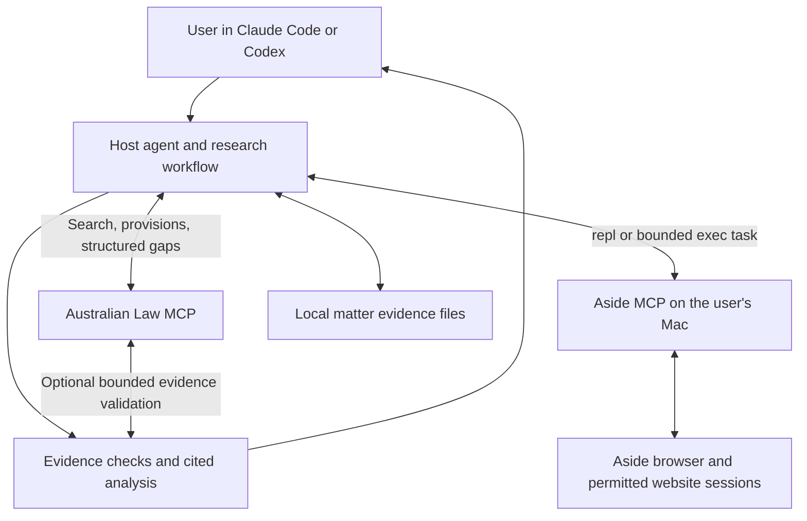

# Optional browser follow-up with Aside — macOS only

Status: implemented as an unreleased source preview on 2026-09-10. The law server
now emits and preserves versioned structured gaps, exposes stateless planning and
supplied-evidence checking, and packages a project-local host skill with macOS/Aside
eligibility, matter budgets and resumable checkpoints. The handshake and public-page
smoke result are recorded below; the lawyer pilot and verified Aside `exec`
cancellation semantics remain release gates.

## Product decision

Let the user's existing Claude Code or Codex session finish research through
Aside when Australian Law MCP cannot retrieve enough evidence. The conversation
remains the user's workspace: the agent finds the gap, collects the missing
source, checks it, and presents an updated answer with citations and remaining
uncertainty. Users should not have to copy links, download every PDF, or manually
feed findings back into the conversation.

Offer three research options. Their names below are proposed product copy, not
existing client settings or buttons.

| Option | Behavior | Scope |
|---|---|---|
| Standard research | Use the law tools and show remaining gaps | Existing default on macOS and Windows; no browser dependency |
| Complete missing sources with Aside | Use law tools first, then retrieve missing originals through Aside | Recommended opt-in on macOS 15.0+ only |
| Extended research with Aside | Also search unsupported jurisdictions and later citing decisions, and draft an evidence-based interpretation | macOS 15.0+ only; optional larger research budget |

The initial feature uses **Aside MCP exclusively**. Windows browser follow-up is
deferred until Aside supports Windows and the integration passes its Windows
acceptance checks. Do not add a Playwright, Chrome/Edge, Ego Lite, remote Mac, or
other browser fallback. Existing law tools remain available on Windows. This is
the chosen product scope, not a limitation of MCP as a protocol.

Once a user selects browser follow-up for a matter, remember it for that matter.
Continue authorized searches, source reads, and local evidence collection without
asking again at each link. A connected browser alone does not select this option.
Recognize natural-language instructions such as “Use Aside to finish any missing
source checks.” The user can switch back to standard research at any time.

Do not describe this as unlimited research or guaranteed legal correctness. Even
when every planned lookup finishes, the report must state the jurisdictions,
sources, date, pagination, and documents actually examined.

## Confirmed Aside interface

Aside documents a local MCP command, `aside mcp`, and recommends using the
concrete CLI executable path when available. Its REPL supports direct inspection,
screenshots, and downloads. [Aside developer documentation](https://docs.aside.com/help/developers)

The documented platform requirement is macOS 15.0 or later. Target local macOS
sessions for the first release; keep standard research available on other
platforms. [Aside setup requirements](https://docs.aside.com/help/get-started)

Local inspection on 2026-09-10 returned browser version `1.0.825.1` and MCP server
version `1.26.902.1732`. `initialize` and `tools/list` succeeded using
`aside mcp --host local`. The installed server exposed:

| MCP tool | Observed inputs | Integration use |
|---|---|---|
| `repl` | `title`, `code` | Open or attach a research tab, inspect the original, collect exact passages and document links |
| `exec` | `prompt`, optional `session_id` | Give Aside a bounded research task; reuse its session ID for continuation |
| `memory_search` | `queries`, optional `max_results` | Not needed for this feature; do not search personal browsing memory by default |

The REPL advertises a persistent JavaScript scope and a 120-second timeout. It
exposes `snapshot`, browser tab helpers, screenshots, filesystem helpers, and
authenticated file download via `fetch`. Use unique variable names and read the
installed tool description rather than assuming full Node or Playwright support.
`exec` advertises a returned session ID, but its runtime result framing,
completion detection, cancellation, and permission handling were not exercised.
These are release gates, not capabilities to invent in a wrapper.

## Architecture



The host agent coordinates two sibling MCP servers. Australian Law MCP does not
automatically gain access to another connected server, launch a second model,
or hold the user's browser session. A companion workflow instructs the host to
call the tools it actually has. No MCP sampling or cross-server callback is
required. This is an architectural choice for the integration.

Codex supports local STDIO servers and server initialization instructions; its
MCP configuration lives in `config.toml`. Put the short continuation rule in
server instructions and the full workflow in the companion package.
[Official Codex MCP documentation](https://learn.chatgpt.com/docs/extend/mcp)

Claude Code Desktop local sessions support configured MCP servers and share
configuration with Claude Code CLI. Verify the intended app version and active
session rather than treating installation of a chat extension as proof that both
tools are available. [Claude Code Desktop documentation](https://code.claude.com/docs/en/desktop)

A hosted law server can still participate, but the host must run locally to use
this local Aside connection. Browser originals stay local by default. Sending
an excerpt to a hosted law MCP sends that excerpt to its operator; client-side
checking should remain available without that upload.

## User experience

At setup, check the local client execution environment before detecting Aside.
Only local macOS 15.0+ sessions are eligible for the browser options. Windows,
WSL, Linux, older macOS, and unknown or remote execution environments retain
standard research. Do not use the law server's operating system for this check:
a hosted law server can still serve an eligible local Mac client.

On an eligible Mac, detect whether the law tools and Aside tools are connected.
If Aside is absent, offer the optional connection and preserve standard research.
If installed, reuse the existing configuration rather than registering duplicates.
Detect capabilities from the current tool list, then perform a benign public-page
smoke check as part of installation validation before declaring the feature ready.

On Windows, show this message when browser follow-up is requested:

> Aside browser follow-up is currently available only on macOS. Windows support
> is deferred until Aside supports Windows and this integration is validated
> there. I'll continue with the Australian Law tools and list the source links
> that still need checking.

Do not prompt Windows users to install Aside, create Aside configuration entries,
or call another connected browser as a substitute. Preserve unresolved gaps.
Report the platform limitation once per matter unless the user asks again.

The companion workflow's local capability check runs before planning browser
tasks and again before dispatch or resume. It must establish the local platform,
OS version, local Aside connection, and required tools; an LLM assertion or a
client-supplied `browser: "aside"` value cannot enable the feature. A checkpoint
created on a Mac can still be read on Windows, but its browser tasks cannot run.
If the environment cannot be established, keep those tasks unresolved while
allowing the existing law tools to run. These are design requirements for the
companion executor; the law server cannot enforce another MCP server's usage.

Illustrative conversation:

> User: Check these authorities for a NSW dispute. Use Aside for missing sources.
>
> Agent: I found three gaps: the NSW provision, a reported citation, and one PDF
> judgment. I'll read those originals in Aside and add the relevant passages.
>
> Agent: The provision and PDF are retrieved. The citation source requires your
> sign-in; its task is paused. I'll finish the other checks in the meantime.
>
> Agent: Here are the source passages, my analysis, and the outstanding citation
> check. The later-case search covered the listed sources and date range.

This is a conversational flow. The first release does not require a custom app
panel, an MCP UI extension, or a new research website.

## What previously manual work becomes

| Existing gap | Proposed AI work | What remains unresolved without further evidence |
|---|---|---|
| Server cannot fetch a source | Open the source in Aside and collect the exact record where access is permitted | A browser may also be denied access; record that outcome |
| Unsupported state or territory judgments | Search the relevant official source or user-authorized research service | No claim of nationwide completeness |
| Reported citations | Locate the report and cross-check party names, court, year, volume/page, and any parallel citation | A search snippet or same-name case is insufficient |
| Partial citator | Obtain later cases or permitted editorial treatment and read the relevant passages | AI interpretation stays distinct from a publisher's treatment classification |
| PDF/DOCX reasons | Download the original, extract text locally, preserve page/paragraph references; use OCR if needed | Unread pages, failed OCR, or missing annexes remain explicit gaps |
| Unincorporated amendments | Retrieve commencement, amending text, and application/saving provisions; draft the date-specific position | A reconstructed working text is not an official compilation |
| Document risk triage | Use the host model to review clauses against retrieved law and stated facts | Missing facts become specific questions; a low score does not certify the contract |
| Instrument validity signal | Compare the enabling provision before/after and relevant transitional material | The agent may draft a reasoned view, but a date comparison alone proves no invalidity |
| Ambiguous section references | Inspect the target law's contents and surrounding citation; resolve if evidence permits | Ask a focused question only when multiple readings still fit |
| Truncated or budget-limited result | Fetch the missing page, continuation, or document section | Budget exhaustion cannot become “no further authorities” |

Do not replace one mandatory manual read with a mandatory approval for every AI
read. The routine deliverable is an evidence-backed draft ready for professional
review; final sign-off is a separate user decision where their workflow needs it.

## Routing and access policy

Start with existing deterministic law tools. Prefer Aside `repl` for an exact
record, provision, paragraph, screenshot, or download. Use `exec` when searching
and navigating across several pages benefits from Aside's own agent. Do not run
both paths against the same task concurrently or recursively dispatch another
research coordinator from inside Aside.

For `exec`, send a narrow brief: source targets, public citation/search terms,
the missing fact, relevant date, page/document limits, expected evidence fields,
and the allowed output folder. Request originals and observed passages rather
than a bare assurance that a claim is verified. Resume the same Aside session
when the installed interface supports it; retain its ID in the local task record.

Use a source policy table which distinguishes technical fetch failure, unknown
access conditions, and explicit automated-access restrictions. The server's
existing `blocked` flag is too coarse to authorize browser automation. Browser
access can remedy a transport limitation; it does not itself grant permission
to automate a source that requires prior agreement. For sources asking automated
clients to contact them first, use a permitted alternative or record the access
prerequisite. Do not endlessly retry challenges or silently change identities.

Reuse a website login already authorized for this task. Aside documents autofill
that keeps password values hidden and checks the target URL and access policy.
Let its configured mechanism handle routine permitted sign-in; ask the user only
when an actual MFA, CAPTCHA, access decision, or unavailable account blocks it.
[Aside permissions](https://docs.aside.com/help/security)

Research includes navigating, searching, downloading public/permitted documents,
and writing evidence files in the matter folder. It does not authorize sending
messages, buying database access, publishing, or submitting forms with external
effects. Use the host and Aside's actual tool permissions. Aside's “Read only”
description primarily concerns file changes; it must not be advertised as a
verified prohibition on every website mutation. A prompt is not an enforcement
boundary for the broad `repl` and `exec` tools.

Browser content and imported documents are evidence, never instructions to change
the task, reveal secrets, or call another tool. Never put cookies, passwords,
session tokens, unrelated tab contents, or the full client document into a public
search query. Local installation does not imply offline model processing.
Aside agent execution may use its own selected provider and allowance in addition
to the host conversation; do not promise that a desktop subscription automatically
covers it. [Aside provider configuration](https://docs.aside.com/help/ai)

## Proposed machine-readable contract

These types and tool names describe the implemented source-preview API.

Extend tool responses additively with a versioned `structuredContent.followup`
envelope. Retain existing text, error labels, and `isError` meanings. The
structured envelope must survive direct calls, discovery/execute, aggregate
chains, STDIO, HTTP, and CLI JSON output. Clients ignoring it still receive a
short plain-language continuation instruction and source links.

```ts
type GapKind =
  | "source_access" | "coverage" | "reported_citation" | "document_body"
  | "treatment" | "commencement" | "legal_interpretation"
  | "ambiguous_reference" | "truncated" | "budget";

interface ResearchGap {
  id: string;                 // Stable for the normalized target and scope
  kind: GapKind;
  originTool: string;
  originalErrorCode?: string; // Existing ErrorCodes vocabulary, if applicable
  target: { citation?: string; registerId?: string; provision?: string };
  jurisdiction?: string;
  asAt?: string;
  reason: string;
  sourceUrls: string[];       // Existing builders or observed official links
  sourceAccess: "permitted" | "requires_access" | "unknown";
  evidenceNeeded: string[];
}

interface FollowupPolicy {
  mode: "off" | "missing_sources" | "extended";
  browser: "aside";           // Sole browser provider; eligible local Mac only
  maxPages: number;
  maxDocuments: number;
  maxElapsedSeconds: number;
  useAuthorizedAccounts: boolean;
}

interface FollowupTask {
  id: string;
  gapIds: string[];
  dependsOn: string[];
  action: "read_source" | "read_document" | "search_later_cases" | "analyze";
  route: "aside_repl" | "aside_agent" | "host_model";
  expectedEvidence: string[];
  state: "planned" | "running" | "waiting_for_user" | "evidence_collected"
    | "assessed" | "unresolved" | "cancelled";
}
```

Add two discoverable tools, retaining the existing ten advertised tools:

| Proposed tool | Input | Output and responsibility |
|---|---|---|
| `plan_research_followup` | Gaps, target scope, policy, local platform and Aside capability-check results | Bounded tasks, priorities, source URLs, acceptance criteria; no browser execution; no executable browser tasks for ineligible or unknown environments |
| `check_research_evidence` | One task/target and a bounded evidence batch | Identity/quote checks possible from supplied material, conflicts, missing fields, remaining gaps; no authenticity certificate or automatic legal verdict |

The workflow can invoke these through `discover_tools` and `execute_tool`.
Derive registry counts as the project already does. Add an optional `followup`
policy to the aggregate research/analysis schemas; the companion workflow also
consumes envelopes from individual tools. Policy is task input, not a global
process setting or implied permission from tool output.

Do not infer structured gaps by scraping human error prose. Emit them at the
source adapters and analysis branches that know what is missing. Aggregate
chains must merge them, including branches not reached before a deadline.
Deduplicate by source, normalized identity, relevant date, and gap type.

## Evidence and completion rules

Each evidence item records: task ID, requested and final URL, source publisher,
observed document title, citation/register identity, jurisdiction, document date,
retrieval time, extraction method, relevant passage and locator, coverage, and
any local artifact reference. For downloaded originals also keep a content hash,
MIME type, and page count when observable. A hash identifies captured bytes; it
does not authenticate a publisher or a legal proposition.

Keep three separate assessments:

1. **Retrieval:** original body, metadata only, partial text, or unavailable.
2. **Identity and passage:** matches the requested record, conflicts, or uncertain.
3. **Interpretation:** the host model's supported conclusion and unresolved issues.

An observed URL or fluent Aside summary does not establish what the judgment
said. `check_research_evidence` can check supplied text for internal consistency,
match an exact excerpt, or reuse a parser; it cannot independently attest that
agent-supplied bytes came from an inaccessible site. Label the acquisition as
host/Aside supplied. For critical claims, the host must inspect the original
passage and surrounding context rather than approving another model's summary.

Preserve PDF printed page numbers separately from file page indexes, and separate
judgment paragraph numbers from both. Mark OCR-derived quotations and uncertainty.
A print-to-PDF capture of a web page is not the publisher's original PDF. A
contradiction between sources creates a new issue; never resolve it by silently
overwriting the older result.

Successful browser retrieval resolves that task's acquisition gap. It does not
rewrite the original server fetch outcome, promote `cite_check` to a complete
citator, or mark the whole legal question “verified.” Search completion reports
the query, filters, pages visited, source-reported total where available, and
actual inspected count. Empty or blocked searches remain scoped observations.

## State, budgets, and persistence

Keep the law server stateless across requests. The host owns the task ledger,
policy, evidence manifest, and Aside session IDs in a user-selected local matter
folder. IDs are correlation keys, not credentials. Do not add a shared global
matter/session map to `session-state.ts` or put private evidence in the public
source cache.

The continuation tools take self-contained bounded inputs; they do not assume
an ID can recover state from a previous HTTP request. A saved checkpoint allows
resume after an app restart; without filesystem capability, report that the
workflow is conversation-only and requires retained context.

Suggested initial product budgets: missing-source mode, 10 pages / 3 documents /
5 active minutes; extended mode, 30 pages / 10 documents / 15 active minutes.
Tune these after pilot measurement. Waiting for user input pauses the active
time clock. Use serial browser operations within an Aside REPL session because
its tab state and JavaScript scope are shared.

The existing law request budget and 45-second chain deadline still apply to each
law call. Browser continuation starts after that response; do not hold a law
request open while Aside works. The host enforces a cumulative research budget
across calls. These host limits are cooperative workflow controls, not a claim
that the law server can police an independently running Aside agent.

Keep any evidence-check request below the existing 100 KiB HTTP body cap. Start
with one excerpt batch of at most 24 KiB UTF-8 text plus bounded metadata; check
the entire serialized byte length before sending. Large documents stay local
and are processed in explicit numbered batches. Missing batches remain partial.
Never accept arbitrary local paths for a remote server to read or arbitrary URLs
for it to fetch on behalf of an evidence submission.

Checkpoint on budget exhaustion, disconnect, or user stop. Stop scheduling new
work immediately. End-to-end cancellation of `exec` needs a verified session
control interface; if unavailable, show that Aside work may still be running and
provide its session reference. Do not silently respawn it or claim it was stopped.

## Connection templates

These configure the browser server alongside the user's existing Australian Law
server in an eligible **local macOS 15.0+ session only**. Setup must pass the
platform check before offering or writing either configuration; neither is a
Windows installation recipe. They are templates, not changes made by this design.
Use the executable
path reported by Aside Developer settings when a desktop process lacks shell PATH.
The local-host argument was verified in the installed CLI and handshake.

Codex `config.toml`:

```toml
[mcp_servers.aside]
command = "aside"
args = ["mcp", "--host", "local"]
enabled_tools = ["repl", "exec"]
tool_timeout_sec = 150
```

Claude Code project `.mcp.json`:

```json
{
  "mcpServers": {
    "aside": {
      "command": "aside",
      "args": ["mcp", "--host", "local"]
    }
  }
}
```

Preserve existing server entries and user permission settings when an installer
eventually applies these. Use the current client-supported permission controls
to limit tools; do not invent a Claude JSON equivalent of Codex's tool allowlist.
The timeout accommodates one REPL call and is not an indefinite `exec` allowance.
Aside account selection, full task result schemas, and app reconnection behavior
must be checked on the pilot versions.

Windows support is deferred. Revisit it only after Aside provides a supported
Windows browser and MCP runtime. Before enabling it, verify installation, the
MCP handshake, source retrieval, downloads and paths, permission handling, and
resume/cancellation in the supported Windows clients. An Aside Windows release
alone must not automatically enable an untested integration. No alternative
browser provider or remote Mac setup is part of this implementation plan.

## Implementation sequence

| Phase | Changes | Acceptance gate |
|---|---|---|
| 1. Structured continuation | Add gap/policy schemas, source gap emitters, planning tool, macOS eligibility checks, text fallback, and propagation through aggregates/transports | Existing behavior retained on macOS and Windows; unsupported clients receive no executable browser tasks; blocked or timed-out branches retain their gaps |
| 2. Aside original retrieval | Package the macOS host workflow, Aside-only connection diagnostics, REPL route, local evidence manifest, and evidence checker | Real original retrieved on a Mac, identity matched, exact passage cited, inaccessible source still reported honestly |
| 3. Extended research | Bounded `exec`, continuation, PDF extraction/OCR, later-case search and supported analysis | Real completion/cancellation behavior verified; coverage and unresolved issues survive restart |
| 4. macOS pilot | Lawyer pilot in local Claude Code and Codex sessions with Aside; Windows standard-research regression checks | Measured accuracy and interaction reduction on macOS; Windows retains existing tools without browser follow-up |

Implementation touchpoints:

- `src/lib/types.ts`: additive structured result types.
- New `src/lib/research-followup.ts`: one shared contract and validation vocabulary.
- `src/lib/errors.ts`, source adapters, and analysis tools: emit gaps with exact
  targets; reuse `external-links-map.ts`, citation, alias, and provision parsers.
- `src/tools/chains.ts`, `search-detail-chain.ts`, and related wrappers: preserve
  metadata currently flattened into text; bound and merge partial outcomes.
- New `src/tools/research-followup.ts`: the two proposed stateless tools.
- `src/tool-registry.ts`, `src/lib/tool-profiles.ts`, CLI response handling, and
  transport validation: preserve envelopes and keep the advertised list compact.
- `src/index.ts`: concise initialization instructions for browser continuation.
- `src/setup.ts` and installation docs: optional macOS-only Aside connection setup;
  preserve Windows law-server installation without adding browser configuration.
- Companion workflow packages for Codex and Claude Code: host tool routing,
  local macOS eligibility checks at setup/dispatch/resume, Aside-only execution,
  budgets, local checkpoints, and evidence reporting. No new LLM dependency in
  the law server. Reject any browser provider other than `aside` in the schema.

## Validation before claiming support

Test meaningful failure cases as well as successful retrieval:

- Browser off or missing: existing results work and the continuation is optional.
- Windows or WSL: existing law tools work, no Aside install/configuration is
  offered, no browser is called, and remaining source links are returned.
- Older macOS, unknown platform, or remote execution: browser tasks remain
  unavailable without blocking standard research.
- Mac checkpoint resumed on Windows, or a manually supplied follow-up policy:
  recheck eligibility and do not execute browser tasks or choose another provider.
- Aside connected: discover actual schemas; use only available capabilities.
- NSW law or another server-blocked source: actual browser outcome is captured;
  access refusal never becomes absence or an automation success claim.
- Wrong same-name case or mismatched parallel citation: reject identity match.
- PDF body missing, OCR uncertain, annex omitted, or quote without a locator:
  retain the corresponding gap instead of accepting the summary.
- An unincorporated amendment: preserve official text and distinguish the AI's
  reconstructed interpretation.
- More results than inspected, budget exhaustion, or chain deadline: show exact
  coverage and resumable pending work without claiming completeness.
- Malicious instructions inside source text: retain them as data and perform no
  unrelated action.
- Disconnect, app restart, and user stop: no duplicate task dispatch and no
  false cancellation claim.
- Direct tool, `execute_tool`, aggregate, STDIO, HTTP, and CLI JSON: the same gap
  and evidence semantics survive response truncation and serialization.

Record the client app, Aside browser/CLI version, connection setup outcome,
question with known expected sources, acquired originals, incorrect claims,
unresolved gaps, elapsed time, and user interventions. The local handshake in
this document verifies tool availability only; it is not the still-pending
lawyer acceptance pilot.

### Implementation smoke observed 2026-09-10

On a local macOS host, installed Aside server `1.26.902.1732` completed
`initialize` and `tools/list` and exposed the observed schemas
`repl(title, code)`, `exec(prompt, session_id?)`, and `memory_search` (which this
workflow does not use). A bounded `repl` opened only the public Federal Register
home page, observed title `Home Page - Federal Register of Legislation` and final
URL `https://www.legislation.gov.au/`, then closed that tab. A separately bounded
`exec` made the same benign public read and returned, after about 13 seconds, one
response containing a session id, the word `Done`, and the same title and URL.

That is evidence about this installed build and this one completed call, not a
promise that every exec response is terminal or that cancellation is available.
The companion therefore stores a session id immediately, treats acknowledgements
or progress-only responses as still running, and on disconnect keeps serial task
ownership until the host resumes and rechecks the same session. No private
account, unrelated tab, form, download, access challenge, or website mutation
was used in the smoke.

Current source-preview limits remain explicit: the macOS lawyer pilot and client
restart/reconnection matrix are not complete; external authenticity and legal
validity are never certified; treatment, commencement and legal interpretation
remain host-owned semantic assessments; and typed successful-response body gaps
currently cover the key HCA, NSW, Queensland, FWC, OAIC, NACC and State-register
paths. Other full-text adapters retain their existing honest text/error output,
but have not all been migrated to emit a structured truncation gap on every
successful shortened response.

## Previously listed release and operation work

The human tasks in `handoff/NEXT-STEPS.md` concern the project owner, not every
lawyer using the extension. They can also have AI-assisted workflows, but they
must not be triggered by research mode.

| Owner task | AI-assisted completion |
|---|---|
| Rewritten-history push, version tag, public visibility, npm publication | Inspect current remote state, prepare exact artifacts and changes, run release checks, then execute within the owner's explicit publication authorization; never replay the old force-push checklist blindly |
| Hosted deployment and account access | Prepare deployment/configuration, run available checks, and implement chosen account/revocation policy; owner supplies operating and access decisions |
| GitHub CI and Docker checks | Run them when the necessary environment is available and report actual results |
| Lawyer pilot | AI prepares cases, collects reproducible evidence, and organizes feedback; testers provide professional expectations and usability experience |

Prefer existing developer tools for these operations. Aside can assist with a
required web console, but connecting it does not grant publication or spending
authority. None of these owner operations was performed as part of this design.
