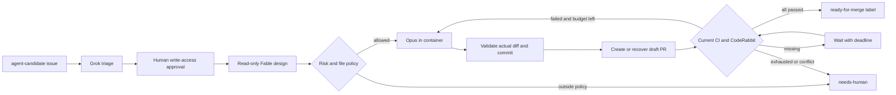

# Issue Agent automation

This optional Linux service triages GitHub issues with Grok, waits for a human
maintainer's approval, designs with Fable, implements with Opus, and creates a
draft PR. It labels a PR ready-for-merge only after current CI and CodeRabbit
checks and a current CodeRabbit approval pass. A maintainer changes draft status
and merges through branch protection. There is no automatic merge implementation.

The repository already has an origin remote, an MIT LICENSE, and CI. Installing
this code does not install the CodeRabbit app, change repository visibility or
branch protection, create labels, start the service, or publish a PR.

## Flow and boundaries

The daemon, policy, credentials, Git operations, and journal are trusted. Issue
text, repository contents, model output, and review feedback are untrusted.
Workers receive JSON prompts over stdin. Executables and argv come exclusively
from the operator's config and use shell: false.

Each issue run owns a separate bare repository and detached Git worktree under
the private state directory. Workers never mount either one. Grok gets an empty
directory; Fable gets a read-only source snapshot; Opus gets a writable snapshot.
The daemon stops the container, rejects links/special files/oversized output,
validates all changed paths against both policy and the Fable design, and imports
only that diff. Git hooks, global configuration, and interactive credential
prompts are disabled. A crashed partial import is reset in this private worktree
before retrying. The developer's working checkout is not used for implementation.

Worker containers use a non-root UID, read-only root filesystem, dropped
capabilities, no-new-privileges, process/CPU/memory limits, ephemeral home, and a
digest-pinned image. No GitHub token, SSH agent, host home, Docker socket, or
daemon state is mounted. Only explicitly configured model-provider credentials
enter workers. Provider credentials must have their own usage limits; do not
reuse an orchestrator credential as a provider key.

## Build and dry-run

From the repository root:

    npm ci --ignore-scripts
    npm run typecheck
    npm test
    npm run build
    npm run build:automation
    npm run automation:dry-run

Automation builds into build-automation/ and is excluded from the MCP build and
npm package. It uses Node's fetch and existing Zod/dotenv dependencies; there is
no additional GitHub SDK or native database dependency.

The final command validates automation/config.example.json and prints the
pipeline, gate identities and limits. It does not read credentials, call GitHub,
invoke workers, create a journal, or create worktrees. Compiling the TypeScript
beforehand writes only build-automation/.

For an authenticated, read-only discovery against the configured repository:

    AUTOMATION_ENV_FILE=/etc/issue-agent/agent.env node build-automation/daemon.js --config /etc/issue-agent/config.json --dry-run --once

This lists candidate issue numbers and input hashes. It does not simulate a
model's triage or authorize an issue. The GitHub adapter rejects every mutation
in read-only mode. Live single-poll execution uses --once without --dry-run;
that mode CAN invoke models, change labels, push branches, and create PRs.

## VM and image setup

Use a dedicated non-root Linux service account, a supported Node LTS (Node 24 is
recommended), Git, and a local Docker Engine. The service account needs Docker
access. Membership in the Docker group is privileged host access: keep that
account exclusive to the daemon. Do not register this VM as an Actions runner.
The existing GitHub-hosted CI tests Linux and Windows.

Provide a trusted image containing Linux Node, Grok Build, Claude Code, and the
tools needed to run the repository's tests. Pin the provider CLI versions in
that toolchain. The included Dockerfile adds the provider adapter:

    docker build --build-arg TOOLCHAIN_IMAGE=YOUR_TOOLCHAIN_IMAGE_AT_SHA256_DIGEST -f automation/Dockerfile -t issue-agent-worker .

Publish or otherwise obtain a repository digest for that image, pre-pull it on
the VM, and set sandbox.image to the full name@sha256:... value. Runtime pulls
are disabled. Inspect the image to ensure it contains no credentials, extra
mounts, or unwanted background services. Adapt executable paths to the image.

The default sandbox.network is none, which deliberately cannot contact model
APIs. Before using remote models, configure a dedicated Docker network whose
firewall/proxy permits only the required provider endpoints (and a dependency
registry if needed). Block host services, private networks and metadata
endpoints. A named Docker network alone does not implement these restrictions.
Host/default bridge networking is rejected by configuration.

Keep state on a private local filesystem with sufficient space and a disk
quota/monitoring for scratch files. Container memory limits do not limit files
written to the bind-mounted snapshot. Avoid NFS/shared multi-host state. The
journal implements a single-daemon local lock, not distributed coordination.

## Configuration and provider CLI contracts

Copy automation/config.example.json to /etc/issue-agent/config.json. Set actual
repository, token-owner login, private state directory, worker image, network,
provider commands, and the observed CodeRabbit identities. The example image
digest and CodeRabbit IDs are placeholders. Leave enabled false until setup
and the read-only checks are complete.

Each sandbox role has an absolute executable and an argv array. Do not put
prompts, credentials, shell snippets, or issue-derived arguments in this config.
The included adapter receives the daemon prompt over stdin and passes that same
prompt to the provider over stdin. Schema and model flags are separate argv.
It supports raw JSON and the structured_output, result, or response JSON
envelopes; unsupported output is rejected.

The adapter's Grok/Claude options were checked against locally installed CLI
help when implemented. They still need a smoke test against the pinned Linux
versions and the VM's available models. No paid provider invocation is part of
the offline suite.

| Role | Example adapter argv after node | Behavior |
| --- | --- | --- |
| Grok | /opt/issue-agent/agent-json.mjs grok /usr/local/bin/grok | Uses Grok's default configured model; optional fourth argv selects an explicit model. No tools/subagents/web search; one turn. |
| Fable | /opt/issue-agent/agent-json.mjs fable /usr/local/bin/claude fable 2 | Claude print mode, Fable model, read tools only, USD 2 maximum per invocation. |
| Opus | /opt/issue-agent/agent-json.mjs opus /usr/local/bin/claude opus 5 | Claude print mode, Opus model, file/edit/bash tools, USD 5 maximum per invocation. |

Claude uses bare mode, no persisted session, explicit tools, no inherited MCP
servers and dontAsk permissions with explicit allowed tools. The container is
the enforcement boundary even if a CLI ignores its own tool restrictions.
The Grok prompt file is /dev/stdin inside Linux, not a host prompt file.

Successful workers must emit one JSON object:

- Grok: summary, eligible, risk (low/medium/high).
- Fable: summary, risk, exact files, acceptanceCriteria, testPlan.
- Opus: summary and tests (commands/results).

The daemon supplies the full JSON Schema. Missing/extra fields, invalid JSON,
empty acceptance criteria, and out-of-policy designs stop for human handling.
An Opus report is descriptive; CI remains authoritative for test success.
Top-level node_modules/, build/, build-automation/, coverage/, and .vitest/ are
discarded snapshot outputs, never imported into the Git worktree.

Limits are persisted before work begins:

- maxAttempts counts ALL implementation starts, including interrupted ones.
- maxWorkerCalls includes triage, design, implementation and retries.
- maxReservedWorkerSeconds charges a full worker timeout for each invocation;
  unused reservation is not refunded after a crash.
- runTimeoutSeconds limits approved work; checkTimeoutSeconds bounds missing
  checks/review. API/provider failures also have a bounded infrastructure budget.
- maxActiveRuns and maxIssuesPerPoll limit admission. Keep these low for public
  issues because triage consumes model resources before maintainer approval.

The Claude adapter supplies an additional dollar cap per invocation. Grok is
limited by turns, calls and timeout; these are not a precise dollar ceiling.
Use provider-account spend limits for an overall monetary cap.

## GitHub token and approval

Use a dedicated account's fine-grained PAT, limited to this repository:

| Repository permission | Access | Purpose |
| --- | --- | --- |
| Metadata | Read | Collaborator permission lookup |
| Contents | Read/write | Fetch base, create/update only managed branches |
| Issues | Read/write | Read issues/events, publish triage/design, manage status labels |
| Pull requests | Read/write | Create draft PRs, read reviews and comments |
| Checks | Read | Read CI/CodeRabbit check runs |
| Commit statuses | Read | Read optional legacy CodeRabbit statuses |

No Actions write, Workflows write, Administration, or merge automation permission
is required. Deny the bot bypass rights in repository rules. The daemon's Git
credentials are provided only to trusted Git processes through environment-based
Git configuration, never persisted in a worktree or passed to a worker.

Set AUTOMATION_GITHUB_TOKEN in /etc/issue-agent/agent.env and the configured
provider variables from automation/.env.example. Restrict the populated file to
the service account (0600); never put credentials in the image, argv, Git remote
URL, or configuration JSON. Worker stdout has configured provider-key values
redacted before parsing/journaling. Treat state as sensitive and restrict backups.

Create these repository labels before enabling:

| Label | Owner/purpose |
| --- | --- |
| agent-candidate | Maintainer opts an issue into triage |
| agent-approved | Human write/maintain/admin user approves the posted snapshot |
| agent-triage | Daemon triage state |
| agent-awaiting-approval | Waiting for a fresh approval event |
| agent-design | Fable design |
| agent-implementing | Implementation/recovery |
| agent-awaiting-checks | Publishing or waiting for quality gates |
| agent-needs-human | Policy failure, exhausted budget, or operator intervention |
| agent-cancelled | Closed issue/PR or merged PR |
| ready-for-merge | Current observed quality gates passed |

Approval must be a labeled event strictly after the bot's triage comment,
authored by a human whose current repository permission is write or admin.
GitHub maps maintain to write and triage to read. An existing approval label
must be removed and re-added after triage. Event history is paginated.

The journal binds approval to the event ID, actor ID, issue title/body hash and
configuration hash. Editing the issue/config, removing/re-adding approval,
closing the issue, or losing write access invalidates the run. Approval is
rechecked before workers and external writes, after workers, and every ten
seconds during Fable/Opus execution. API failure during that monitoring aborts
the worker rather than assuming approval. Fable cannot expand authorization:
high risk or files outside immutable policy go to agent-needs-human.

## CodeRabbit and branch protection

Install the official CodeRabbit GitHub app on the repository and verify the
features and limits available to this account. Public OSS eligibility and
review limits should be checked with the current CodeRabbit plan; this service
does not assume unlimited free reviews.

The repository configuration enables draft reviews, incremental reviews,
failure reporting and the request-changes workflow. On a controlled test PR,
inspect these endpoints using a repository-scoped credential:

    GET /repos/OWNER/REPO/pulls/NUMBER
    GET /repos/OWNER/REPO/commits/HEAD_SHA/check-runs
    GET /repos/OWNER/REPO/commits/MERGE_SHA/check-runs
    GET /repos/OWNER/REPO/commits/HEAD_SHA/statuses
    GET /repos/OWNER/REPO/pulls/NUMBER/reviews

Configure exact check names, app IDs, reviewer numeric ID, and each CI check's
head or merge target from the observations. Do not guess that a check lives on
the PR head: pull_request CI may test a synthetic merge commit. The example
expects CI quality gate on the merge SHA. If your installation reports it on
the head, configure target head and enforce up-to-date branches in protection.

CodeRabbit defaults to the check surface here. If it emits legacy statuses,
set codeRabbit.surface to status and observe its exact context and creator ID.
In both modes the latest CodeRabbit PR review must be APPROVED for the current
head SHA; a successful review-progress check alone does not pass the gate.
The request-changes workflow is responsible for resolving review threads before
its automatic approval. The daemon does not independently query thread resolution.
Do not use manual CodeRabbit approve/resolve overrides as part of this pipeline.

Require the CI quality gate check from GitHub Actions and the observed
CodeRabbit checks, human review, resolution of conversations, and an up-to-date
branch in repository protection/rulesets. Do not grant bot bypass. The workflow
retains the project's Node 20.19 compatibility floor and adds Node 24; run the
daemon on supported LTS, not Node 20.

The gate rejects missing checks, the wrong producer, old commits, older reruns,
neutral/skipped results, stale reviews and conflicts. Missing results wait until
the deadline; failed complete results can trigger a bounded repair. A new head,
base change, approval loss, or API outage revokes observed readiness. No REST
sequence can atomically lock a PR while adding a label: branch protection is the
final authority, and ready-for-merge is advisory. The draft remains a draft.

## systemd deployment

Install the built checkout at /opt/australian-law-mcp, the config and environment
under /etc/issue-agent, and the private state directory at /var/lib/issue-agent.
Keep application files/configuration read-only to the service account. Adapt the
Node/Docker/Git paths for the VM. The example uses a local system Docker daemon.

Install automation/issue-agent.service as the system unit only after replacing
all placeholders, testing the image/provider adapters and observing remote
checks. Set enabled true in the private config as the last activation step.

    systemctl daemon-reload
    systemctl enable --now issue-agent
    journalctl -u issue-agent -f

Graceful SIGTERM/SIGINT stops polling, cancels the worker, removes its container
and releases the journal lock. No worker process runs on the host. JSON service
logs contain run ID, issue, stage and bounded error information, not prompts or
provider stderr. HTTP/API timeouts and rate-limit delays are bounded.

## Recovery and audit

The atomic, fsynced state.json journal records issue/run IDs, snapshot and
configuration hashes, approvals, design, base/head/pushed SHAs, PR number,
attempts, reserved worker budgets, deadlines and recovery reasons. Back it up
together with the private repos/worktrees. Never reset counters to retry a run.

After a normal restart the same journal resumes. A commit written before its
journal update is recognized by its run/attempt message. A branch push or PR
creation whose response was lost is reconciled by the deterministic branch and
run marker before trying again. External branch changes and closed PRs stop for
a human; the service never force-pushes or opens a replacement automatically.

After SIGKILL, a host crash or a failed storage operation, the lock can remain.
It is deliberately not stolen on a timer: the old worker could still be alive.

1. Stop the systemd unit and verify the owner PID/host in
   /var/lib/issue-agent/daemon.lock/owner.json is no longer running. Disable
   automatic restart during recovery.
2. Inspect and forcibly remove any containers bearing the matching
   issue-agent.run label. Check the worker's activity before resuming.
3. Back up state.json. If it is corrupt, restore a known-good backup and
   reconcile existing branches/PRs; do not replace it with an empty journal.
4. Only after excluding another daemon/worker, remove the daemon.lock directory
   and start the service. Automatic recovery retains charged attempts.

Terminal needs-human/cancelled runs remain in the journal and are not silently
restarted by labels. For changed scope or an exhausted budget, handle the PR
manually or create a new issue that links the prior run and requires fresh
triage/approval. Do not edit the journal to bypass policy.

Source snapshots and private worktrees are retained for audit. During a
maintenance window with the daemon stopped and containers reaped, remove only
the repos/worktrees/scratch directories for terminal run IDs after archiving any
needed diff. Keep their journal records to prevent rediscovery.

## Validation and references

The offline tests use mock GitHub REST responses, temporary real Git
repositories/worktrees and fake CLI executables. They cover approval identity,
revocation, input edits, file policy, secret filtering, command injection,
process limits, duplicate owners, durable attempts, missing/stale checks,
current reviews, failure repair, lost PR responses, and commit recovery.

Actual Docker isolation, provider output formats/model availability, token
permissions, CodeRabbit installation/check identities and branch protection
must be exercised on the deployment VM and a controlled PR before enabling
unattended operation. The offline dry-run reports configuration validity, not
remote readiness.

- [GitHub collaborator permissions](https://docs.github.com/en/rest/collaborators/collaborators#get-repository-permissions-for-a-user)
- [GitHub required checks and merge/head SHA](https://docs.github.com/en/pull-requests/how-tos/merge-and-close-pull-requests/troubleshooting-required-status-checks)
- [CodeRabbit configuration](https://docs.coderabbit.ai/reference/configuration)
- [CodeRabbit request-changes workflow](https://docs.coderabbit.ai/pr-reviews/request-changes-workflow)
- [Docker run controls](https://docs.docker.com/reference/cli/docker/container/run/)
- [Git worktree sharing](https://git-scm.com/docs/git-worktree)
